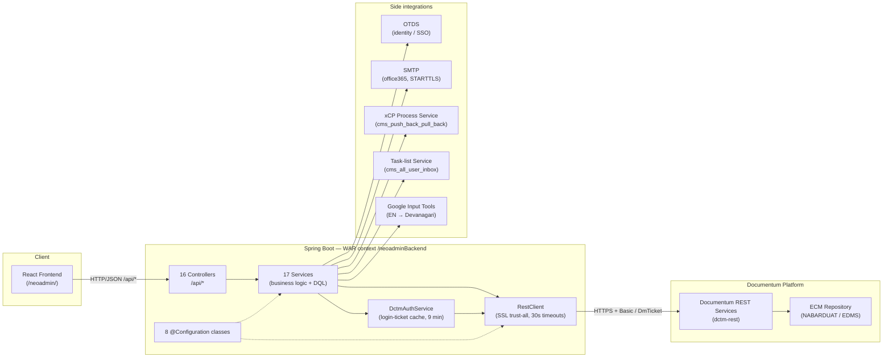
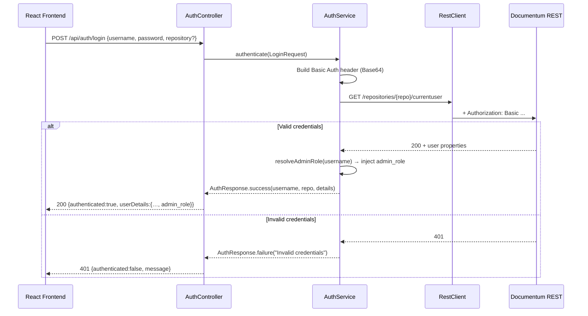
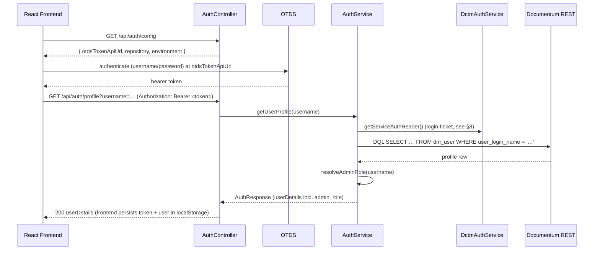
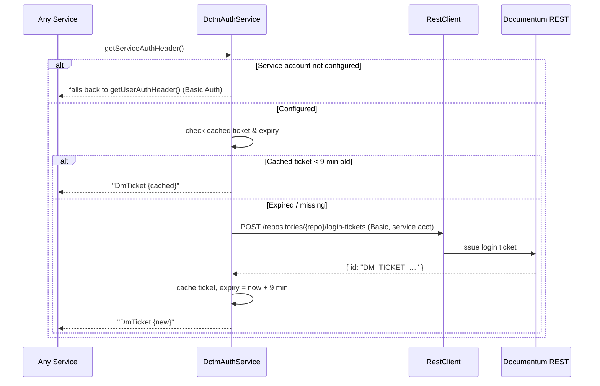
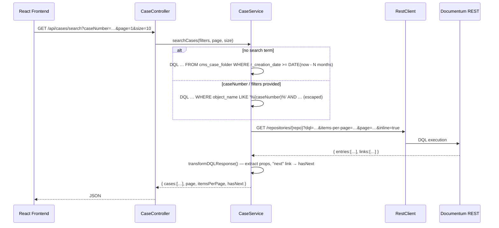
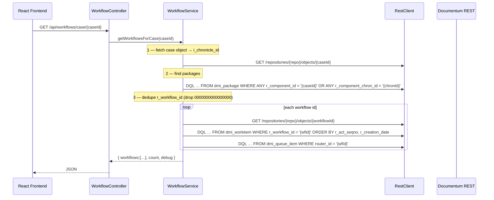

# NEO Admin — Backend Architecture

> **App name:** "NEO Admin" (NABARD) — the Spring Boot API layer behind the admin / support
> console. It has **no relational database**: every read and write is an HTTP call to the
> **OpenText Documentum REST Services** (`dctm-rest`) over DQL, plus a handful of side
> integrations (OTDS identity, SMTP mail, an xCP process service, a task-list service, and
> Google Input Tools for transliteration).

---

## 1. Overview

| Aspect | Detail |
|---|---|
| Framework | Spring Boot 3.4.1 |
| Language | Java 17 |
| Build | Maven (`spring-boot-starter-parent` 3.4.1), `mvn` — no wrapper in repo |
| Packaging | **WAR** (`<finalName>neoadminBackend</finalName>`) — deployable to an external servlet container **or** run with the embedded Tomcat |
| Servlet context path | **`/neoadminBackend`** — the frontend axios `baseURL` is `/neoadminBackend/api` |
| Key starters | `spring-boot-starter-web`, `-validation`, `-actuator`, `-mail`, `-tomcat` (scope `provided`), `-test` |
| Other deps | Lombok (compile-time), `org.apache.poi:poi-ooxml:5.2.3` (Word `.docx` export) |
| ECM integration | Documentum REST Services — HTTP/JSON, DQL, `application/vnd.emc.documentum+json` |
| Auth model | HTTP Basic Auth forwarded to Documentum **+ OTDS SSO** (bearer token issued by OTDS, profile resolved server-side); service-account **login-ticket cache** for privileged ops |
| Config model | **3 Spring profiles** — `uat` (default), `prod`, `azure` — selected by `spring.profiles.active` |
| Logging | SLF4J via Lombok `@Slf4j`; **stock Spring Boot Logback** (no `spring-boot-starter-log4j2` on the classpath). Console + a rolling file appender configured entirely by `logging.*` keys in the profile properties — file `${NEOADMIN_LOG_DIR:Reports Queries}/rajbhasha.log`, 10 MB / 10 history / 100 MB cap. `logback-spring.xml` includes Boot's `base.xml` unchanged and adds a separate **audit** appender → `${catalina.base}/logs/app.log` (see §13). `log4j2-spring.xml` is present but **inert** (Log4j2 is not the active logging system) |

The surface has roughly doubled since the first draft of this document: **16 controllers,
17 services, 8 `@Configuration` classes**, two DTOs, and two entry-point classes.

---

## 2. Architecture Diagram



---

## 3. Deployment & packaging

- `pom.xml` declares `<packaging>war</packaging>` and `<finalName>neoadminBackend</finalName>`,
  so `mvn clean package` produces `target/neoadminBackend.war`.
- `ServletInitializer extends SpringBootServletInitializer` makes the WAR deployable to an
  **external Tomcat**; `spring-boot-starter-tomcat` is scoped `provided` for that path.
- `BackendApplication` (`@SpringBootApplication`) is still a normal executable entry point —
  `mvn spring-boot:run` works for local dev on port 8080.
- Deployed under the context path **`/neoadminBackend`**, so the effective API base is
  `/neoadminBackend/api/...`. In local dev the Vite proxy (`vite.config.js`) rewrites
  `/neoadminBackend` → `http://localhost:8080` and strips the prefix.
- The active environment is chosen by `spring.profiles.active` (default `uat`, set in
  `application.properties`); override at deploy time, e.g.
  `--spring.profiles.active=prod`.

---

## 4. Project structure

```
backend/
 pom.xml                                  # war packaging, poi-ooxml, starter-mail
 src/main/
  resources/
   application.properties                 # shared config + spring.profiles.active=uat
   application-uat.properties              # UAT repo/OTDS/mail/tasklist/process endpoints
   application-prod.properties             # PROD endpoints (real credentials — do not copy)
   application-azure.properties            # Azure endpoints
   logback-spring.xml                      # includes Boot base.xml + adds the AUDIT appender (app.log)
   log4j2-spring.xml                       # INERT — Log4j2 not on classpath; logging is Logback via logging.* keys
  java/com/example/backend/
   audit/                                  # AuditLogInterceptor, AuditController, AuditActions, AuditContext
   BackendApplication.java                 # @SpringBootApplication
   ServletInitializer.java                 # SpringBootServletInitializer (external Tomcat)
   config/
    AppConfig.java                         # prefix app.*  (cases, workflow, sfs)
    DctmConfig.java                        # prefix dctm.rest.*  (url, repo, user, service acct)
    MailConfig.java                        # prefix app.mail.*  (from, fromName)
    OtdsConfig.java                        # prefix otds.*  (url, username, password)
    ProcessConfig.java                     # prefix process.service.*  (url)
    TasklistConfig.java                    # prefix tasklist.*  (url, cmsInboxUrl)
    RestClientConfig.java                  # RestClient.Builder bean — trust-all SSL, 30s timeouts
    WebConfig.java                         # OncePerRequestFilter CORS bean + OPTIONS short-circuit
   controller/    (16)
    AuthController          CaseController        DelegateController    DepartmentController
    DigidakController       GroupController       InboxController       MetadataController
    QueryController         RajbhashaController   SettingsController    SfsController
    SfsUserAccessController TransliterateController  UserController     WorkflowController
   service/       (17)
    AuthService             CaseService           DctmAuthService       DelegateService
    DepartmentService       DigidakService        EmailService          GroupService
    InboxService            MetadataService       OtdsService           QueryService
    RajbhashaService        SfsService            SfsUserAccessService  UserService
    WorkflowService
   dto/
    LoginRequest.java                       # username, password, repository (@NotBlank x2)
    AuthResponse.java                       # authenticated, username, repository, userDetails, message
                                            # + static success(...) / failure(...)
```

---

## 5. Configuration

### 5.1 Profiles

| Profile | Repository | `dctm.rest.url` (example) | Notes |
|---|---|---|---|
| `uat` *(default)* | `NABARDUAT` | `https://ecmrevampuat.nabard.org:2020/dctm-rest` | local + UAT development |
| `prod` | `EDMS` | `https://<prod-host>:6060/dctm-rest` | live environment; OTDS on `:7070` |
| `azure` | `NABARDUAT` | `https://<azure-host>:3030/dctm-rest` | Azure-hosted UAT |

> ⚠️ **`application-uat/prod/azure.properties` contain real plaintext credentials** (Documentum
> passwords, the OTDS service password, the SMTP password). Do **not** reproduce any value in
> documentation, tickets, or commits — use `*(configured)*` / `${ENV_VAR:default}` placeholders.

### 5.2 `@ConfigurationProperties` classes

| Class | Prefix | Bound properties |
|---|---|---|
| `DctmConfig` | `dctm.rest` | `url`, `repository`, `username`, `password`, `serviceUsername`, `servicePassword` |
| `AppConfig` | `app` | `cases.defaultLoadMonths` (default `3`), `workflow.processes`, `sfs.documentTypeFolderId` |
| `MailConfig` | `app.mail` | `from`, `fromName` |
| `OtdsConfig` | `otds` | `url`, `username`, `password` |
| `ProcessConfig` | `process.service` | `url` |
| `TasklistConfig` | `tasklist` | `url`, `cmsInboxUrl` |

### 5.3 Read directly from the `Environment` (not bound to a class)

| Property | Consumer | Purpose |
|---|---|---|
| `otds.token-api-url` | `AuthController.getAuthConfig` | returned to the frontend as `otdsTokenApiUrl` so the SPA knows which OTDS token endpoint to hit for the active environment |
| `spring.mail.*` | Spring Boot mail auto-config | SMTP host / port / credentials / STARTTLS |
| `NEOADMIN_LOG_DIR` | `logging.file.name` placeholder default | log directory; defaults to the relative `Reports Queries` — set to an absolute path in deployment (see §13 Logging) |

### 5.4 Shared app settings (`application.properties`)

| Property | Default | Meaning |
|---|---|---|
| `spring.profiles.active` | `uat` | active environment profile |
| `app.workflow.processes` | `4b02cba08000624a` | comma-separated `r_object_id` of `dm_process` templates surfaced by `/api/workflows/processes` |
| `app.cases.default-load-months` | `3` | months of case history to load when no search term is given |
| `app.mail.from-name` | `NB Support Admin Team` | display name on outgoing mail |
| `app.sfs.document-type-folder-id` | `0b02cba080140d1e` | `r_object_id` of `/SFS Config/Document Type` |

---

## 6. API endpoints

All controllers are under `/api` and carry `@CrossOrigin` (see §12 for exact origins).
Parameters listed are `@RequestParam` unless noted; request bodies are `Map<String,Object>`
unless a DTO is named.

### 6.1 AuthController — `/api/auth`

| Method | Path | Description |
|---|---|---|
| `POST` | `/login` | Authenticate `LoginRequest` against Documentum `/currentuser`; returns `AuthResponse` (401 on failure) |
| `GET` | `/profile?username=` | Post-OTDS profile fetch. Requires an `Authorization: Bearer <otds-token>` header (401 if missing). Uses the **service account** to load the `dm_user` profile and resolve the admin role |
| `GET` | `/config` | Returns `{ otdsTokenApiUrl, repository, environment }` (environment = active profiles) — bootstraps the SPA login screen |
| `GET` | `/login-ticket` | Login ticket for the configured default user |
| `GET` | `/login-ticket/{username}` | Login ticket for a specific user (support impersonation) via `EXECUTE generateUserLoginTicket` |
| `GET` | `/current-user` | Configured username, repository, and whether a service account is configured |
| `GET` | `/users` | Active `dm_user` list (`RETURN_TOP 1000`); flags `isSuperuser` = `user_privileges == 16` |

### 6.2 CaseController — `/api/cases`  (`cms_case_folder`)

| Method | Path | Key params |
|---|---|---|
| `GET` | `/report` | `hoRo`, `location`, `deptNames`, `functions`, `fromDate`, `toDate`, `status`, `priority`, `language`, `page`, `size` |
| `GET` | `/search` | `caseNumber`, `hoRo`, `roShortCode`, `deptNames`, `departmentShortCode`, `functions`, `fromDate`, `toDate`, `page`, `size` |
| `GET` | `/count` | same filters as `/search` |

Queries exclude `is_migrated` rows and `status = 'Delete'`.

### 6.3 WorkflowController — `/api/workflows`

| Method | Path | Description |
|---|---|---|
| `GET` | `/processes` | Process templates from `app.workflow.processes` |
| `GET` | `/instances?processName=&page=&size=` | Running instances for a template |
| `GET` | `/case/{caseId}` | All workflows linked to a case (via `dmi_package`) |
| `GET` | `/search/by-case?caseNumber=` | Resolve workflows from a case number |
| `GET` | `/{workflowId}` | Single workflow detail |
| `POST` | `/{workflowId}/restart` | Restart a workflow (service account) |
| `POST` | `/{workflowId}/activity/{activityId}/retry` | Retry a failed activity (service account) |

### 6.4 GroupController — `/api/groups`  (`dm_group` + `dm_folder` shadow objects)

| Method | Path | Description |
|---|---|---|
| `POST` | `/` | Create a `dm_group` (409 if it exists, 400 on failure). Body: `{group_name, group_display_name}` |
| `GET` | `/search?groupName=&page=&size=` | Paged group search |
| `GET` | `/{groupName}` | Group properties + HATEOAS actions |
| `GET` | `/{groupName}/members` | User + group members |
| `POST` | `/{groupName}/members` | Add member. Body: `{memberName, memberType, memberSrc}` |
| `DELETE` | `/{groupName}/members/{memberName}?memberType=` | Remove member |
| `GET` | `/by-prefix?prefix=&size=` | DQL name-prefix search |
| `GET` | `/by-user?username=` | All groups a user belongs to |
| `GET` | `/vertical-folders?deptName=` | Verticals for an HO department (from `dm_folder` shadows) |
| `GET` | `/verticals?officeType=&deptName=` | Verticals from `/ECM CONFIG` folders |
| `GET` | `/exists/{groupName}` | Existence check |
| `POST` | `/vertical-folder` | Create a `dm_folder` for a vertical under the HO dept folder |
| `PUT` | `/{groupName}/display-name` | Update `group_display_name`. Body: `{displayName}` |
| `GET` | `/search-members?query=&type=` | Search users/groups to add |

### 6.5 UserController — `/api/users`  (`dm_user`, `cms_user_profile`, OTDS)

| Method | Path | Description |
|---|---|---|
| `GET` | `/otds/probe` | OTDS connectivity diagnostic |
| `GET` | `/otds/inspect?userId=` | Full OTDS user record (`attrs=*`) |
| `GET` | `/dm` | `dm_user` list |
| `GET` | `/by-dept?shortCode=` / `/by-location?location=` | Profile lookups |
| `GET` | `/profiles` | Paged `cms_user_profile` search — params `query`, `page`, `size`, `officeTypeFilter`, `locationFilter`, `deptNames`, `uin`, `grade`, `deptCode`, `roCode`, `sortBy`, `sortDir`, `include-total` |
| `GET` | `/profiles/{objectId}` | Single profile |
| `GET` | `/profile-context?username=` | Local-Admin scoping context (office type / location / dept names) |
| `GET` | `/dept-multi` / `/role-members?role=` | Multi-dept members / role members (`localAdmin` \| `cgmSect`) |
| `GET` | `/check-uin?uin=` | UIN duplicate check |
| `POST` | `/` | Create `dm_user` |
| `POST` | `/profile` | Create `cms_user_profile` under `/UserProfile/UsersProfileBO` |
| `POST` | `/otds/setup` | Create the user in the OTDS partition + set an initial password |
| `POST` | `/profiles/{objectId}/vertical-ids` / `DELETE` `/profile-vertical-ids` | Manage a profile's vertical-id list |
| `PATCH` | `/profiles/{objectId}` | Update whitelisted profile properties |
| `PATCH` | `/dm/{loginName:.+}` | Update `dm_user`; strips `user_state` / `user_login_name`; syncs OTDS enable/disable (`user_state == 1` → disable `loginName@DCTMPartitions`) |
| `PATCH` | `/{loginName:.+}/password` | Reset password **via OTDS** |
| `PATCH` | `/{loginName:.+}/inline-password` | Set a Documentum inline password (no OTDS) |

### 6.6 DelegateController — `/api/delegate`

| Method | Path | Description |
|---|---|---|
| `GET` | `/cases` | Delegatable cases — `query`, `hoRo`, `deptName`, `deptNames`, `roShortCode`, `page`, `size` |
| `GET` | `/cases/{caseId}/movement` | Case movement history |
| `POST` | `/` | Delegate a case. Body: `{caseId, performerDisplayName, loginUsername}` → xCP `cms_push_back_pull_back` |

### 6.7 DepartmentController — `/api/departments`

| Method | Path | Description |
|---|---|---|
| `GET` | `/?officeType=&location=` | `dm_folder` list under `/Cabinets/ECM CONFIG/Office Type/{HO\|RO\|TE}/...` |
| `POST` | `/` | Create a department — folders + groups + metadata. Body: `officeType`, `departmentName`, `departmentShortCode`, `dmdSelection`, `locationShortCode`, `locationName` |

### 6.8 DigidakController — `/api/digidak`  (`cms_digidak_folder`, `cms_digidak_metadata`, `cms_digidak_movement_re`)

| Method | Path |
|---|---|
| `GET` | `/report`, `/metadata`, `/users`, `/inbox`, `/draft`, `/verticals`, `/sent-to-options`, `/received-from-options` |
| `GET` | `/{digidakId}/movement` |
| `GET` | `/count`, `/inbox/count`, `/draft/count` |

Filter params across the report/inbox/draft endpoints: `decisionType`, `hoRo`, `location`,
`deptNames`, `fromDate`, `toDate`, `language`, `modeOfReceipt`, `priority`, `secrecy`,
`status`, `typeCategory`, `sourceVertical`, `entryType`, `sentTo` / `receivedFrom`, `region`,
`export`, `page`, `size`.

### 6.9 InboxController — `/api/inbox`

| Method | Path | Description |
|---|---|---|
| `GET` | `/?username=&page=&size=` | `dmi_queue_item` inbox |
| `GET` | `/tasklist?username=&page=&start=` | Proxies the task-list service (`cms_all_user_inbox`) |
| `GET` | `/tasklist/raw`, `/raw`, `/debug-name` | Diagnostic passthroughs |

### 6.10 MetadataController — `/api/metadata`

| Group | Endpoints |
|---|---|
| File numbers (`cms_file_number`) | `POST/GET /file-numbers`, `PUT/DELETE /file-numbers/{objectId}`, `GET /file-numbers/validate-delete`, `GET /file-numbers/check-duplicate` |
| Digidak metadata (`cms_digidak_metadata`) | `POST/GET /digidak/metadata`, `PUT/DELETE /digidak/metadata/{objectId}`, `GET /digidak/filter-options` |
| Case types (`dm_folder` `/ECM CONFIG/Case Type`) | `GET/POST /case-types` |
| Hindi comments (`dm_folder` `/ECM CONFIG/Hindi Comments`) | `GET/POST /hindi-comments` |

### 6.11 SfsController — `/api/sfs`  (`dm_folder` under `/SFS Config/...`)

| Method | Path |
|---|---|
| `POST/GET` | `/document-types`, `/document-categories` |
| `PUT/DELETE` | `/document-types/{objectId}`, `/document-categories/{objectId}` |

### 6.12 SfsUserAccessController — `/api/sfs/user-access`

| Method | Path | Description |
|---|---|---|
| `GET` | `/locations` | SFS locations |
| `GET` | `/users?officeType=&department=&location=&role=&locationShortCode=` | Scoped user search |
| `GET` | `/check-membership` | Is a user in an SFS role group? |
| `POST` | `/add-to-group` | Add a user to an SFS role group (Maker / Checker / Digitization / …) |

### 6.13 RajbhashaController — `/api/rajbhasha`

| Method | Path | Description |
|---|---|---|
| `GET` | `/report?hoRo=&location=&deptNames=&fromDate=&toDate=` | Official-language report (`grid1` / `grid2` / `grid3`) |
| `GET` | `/report/export` | Same report as a Word `.docx` (`application/octet-stream`, `Content-Disposition: attachment`) — built with Apache POI |

### 6.14 TransliterateController — `/api/transliterate`  (`@CrossOrigin("*")`)

| Method | Path | Description |
|---|---|---|
| `GET` | `/?text=` | English → Devanagari; proxies Google Input Tools with a local phonetic-table fallback and a `LETTER_NAMES` map for single-letter initials. Returns `{ result }` |

### 6.15 QueryController — `/api/query`

| Method | Path | Description |
|---|---|---|
| `POST` | `/execute` | Execute arbitrary DQL. Body: `{ dql, limit }` (default limit `10000`); auto-injects `r_object_id` and respects `RETURN_TOP` hints |

### 6.16 SettingsController — `/api/settings`  (`@CrossOrigin("http://localhost:5173")` only)

| Method | Path | Description |
|---|---|---|
| `GET` | `/` | `{ cases: { defaultLoadMonths } }` |

---

## 7. Authentication

Two paths lead to an authenticated session; both end with the backend resolving the
**admin role** from group membership.

### 7.1 Direct Basic Auth (`POST /api/auth/login`)



### 7.2 OTDS SSO (the primary path in `prod`)



**Admin-role resolution** (`AuthService.resolveAdminRole`, via `GroupService.getGroupsByUser`):

| Group membership | Resolved role |
|---|---|
| `ecm_super_admin` | `Super Admin` |
| `ecm_local_admin` | `Local Admin` |
| neither | `Standard User` |

`user_privileges == 16` additionally identifies a Documentum **SUPERUSER**. The frontend
`MainLayout` gates the whole console on `admin_role ∈ { Super Admin, Local Admin }`.

---

## 8. Service account & login-ticket flow



**Key points**

- Documentum login tickets expire in ~**10 minutes**; the cache TTL is **9 minutes** for
  margin.
- On any failure acquiring a ticket, `DctmAuthService` **falls back to Basic Auth** rather
  than throwing.
- `executeAsService(actualUser, fn)` wraps a privileged call with audit logging;
  `clearServiceTicketCache()` forces re-acquisition; `isServiceAccountConfigured()` gates the
  fallback.
- **Impersonation** (`GET /api/auth/login-ticket/{username}`) is separate: it runs the custom
  repository method `EXECUTE generateUserLoginTicket WITH user_name='…'` (10-minute ticket)
  so support staff can act as a user for troubleshooting.

---

## 9. Case search flow



- One DQL query fetches all needed fields — no N+1.
- `app.cases.default-load-months` (default `3`) sets the default date window.
- `is_migrated` rows and `status = 'Delete'` are excluded.
- Pagination rides Documentum REST's `items-per-page` / `page`; `ENABLE(RETURN_TOP n)` caps
  results at the repository.

---

## 10. Workflow resolution flow



- Resolution chain: **Case** → `i_chronicle_id` → **`dmi_package`** → `r_workflow_id` →
  **`dm_workflow`** → **`dmi_workitem`** + **`dmi_queue_item`**.
- Null workflow IDs (`0000000000000000`) are filtered.
- Each sub-step is independently try-caught; partial results are still returned, with debug
  logs embedded in the response.
- `restart` / `retry` use the service account.

---

## 11. External integrations

| Integration | Service / config | What it does |
|---|---|---|
| **OTDS identity** | `OtdsService` + `OtdsConfig` (`otds.*`) | Admin ticket via `POST {otds.url}/authentication/credentials` → `ticket`, sent as the `OTDSTicket` header. Operations: create user (`POST /users`), set/reset password (`PUT /users/{id}/password`), enable/disable (`PUT /users/{id}` → `accountDisabled`), inspect (`GET /users/{id}?attrs=*`), `probeConnection()`. IDs are qualified, e.g. `loginName@DCTMPartitions`. `setupNewOtdsUser` = create-in-partition + set-password. |
| **Email** | `EmailService` + `spring-boot-starter-mail` (`spring.mail.*`, `app.mail.*`) | `JavaMailSender` + `MimeMessageHelper` (UTF-8). `sendPasswordResetEmail(to, userName, newPassword, adminUser)` and generic `sendEmail(to, subject, body) → boolean`. Failures are logged, **never thrown**. SMTP = office365, port 587, STARTTLS. |
| **xCP process service** | `DelegateService` + `ProcessConfig` (`process.service.url`) | `delegateCase(...)`: three DQL lookups, then `POST {process.service.url}/processes/cms_push_back_pull_back` with `assigned_user`. Retries once on the transient "elevate activity" failure. |
| **Task-list service** | `InboxService` + `TasklistConfig` (`tasklist.url`, `tasklist.cmsInboxUrl`) | `GET /api/inbox/tasklist` proxies the task-list service querying `cms_all_user_inbox`. |
| **Transliteration** | `TransliterateController` | Proxies Google Input Tools (EN → Devanagari) with a local phonetic-table fallback; `@CrossOrigin("*")`. |
| **Word export** | `RajbhashaService.exportToWord` + `poi-ooxml` 5.2.3 | Renders the Rajbhasha report to a `.docx` byte stream returned by `GET /api/rajbhasha/report/export`. |

---

## 12. Security notes

### SSL bypass

`RestClientConfig` registers a `RestClient.Builder` backed by
`TrustAllRequestFactory extends SimpleClientHttpRequestFactory`: a no-op `X509TrustManager`,
a permissive `HostnameVerifier` (`(hostname, session) -> true`), an `SSLContext("TLS")` with
those trust managers, and **30-second** connect/read timeouts. This disables TLS certificate
validation for **all** outbound calls to Documentum REST.

```
TrustAllRequestFactory → SSLContext("TLS") with no-op TrustManager + allow-all HostnameVerifier
```

> **Production warning:** suitable only for the self-signed Documentum endpoint. For a real
> production posture, configure a truststore containing the Documentum server's CA
> certificate instead of trusting everything.

### CORS

- `WebConfig` registers a `OncePerRequestFilter` (`corsHeaderFilter`) that reflects the
  `Origin` header **only if** it is in `{ http://localhost:5173, http://localhost:5174 }`,
  sets `Access-Control-Allow-Credentials: true`, allows
  `GET, POST, PUT, PATCH, DELETE, OPTIONS`, and **short-circuits `OPTIONS` with `200`**.
- **Every controller also** carries `@CrossOrigin`. Most allow
  `http://localhost:5173` + `http://localhost:5174`; **`SettingsController` allows only
  `:5173`**; **`TransliterateController` allows `*`**.

> **Production note:** replace the hard-coded `localhost` origins with the real production
> frontend origin(s) and drop the `@CrossOrigin("*")` on `TransliterateController`.

### Constructor injection

All controllers and services use **constructor injection** — Lombok `@RequiredArgsConstructor`
or an explicit constructor. No field-level `@Autowired`. Dependencies are explicit,
immutable, and testable.

### Credential handling

- Regular credentials (`dctm.rest.username` / `dctm.rest.password`) and the OTDS and SMTP
  passwords live in the `application-*.properties` profile files **in plain text**. In
  production these should be externalized (environment variables, Vault, Spring Cloud
  Config).
- Service-account credentials support environment-variable substitution:
  `${DCTM_SERVICE_USERNAME:default}` / `${DCTM_SERVICE_PASSWORD:default}`.
- Login tickets are cached **in memory** in `DctmAuthService` — not persisted, not shared
  across instances.

### Input sanitization

- DQL-injection mitigation: single quotes are escaped (`replace("'", "''")`) on every
  interpolated value (`CaseService`, `AuthController`, `UserService`, and the other DQL
  builders).
- Profile updates apply a **whitelist** of allowed property names — arbitrary field
  modification is rejected.
- `PATCH /api/users/dm/{loginName}` strips `user_state` / `user_login_name` from the inbound
  payload before forwarding.
- `QueryController` executes **arbitrary DQL**. It must be restricted to authorized support
  users in any production deployment; the SPA already hides the Query page from Local Admins.

---

## 13. Error-handling patterns

### Return-map with `success` / `error`

Mutating services (`GroupService`, `WorkflowService`, `DepartmentService`, the
`AuthController` login-ticket handler) return `Map<String,Object>`:

```java
// success
result.put("success", true);
result.put("message", "Operation completed successfully");
// failure
result.put("success", false);
result.put("error", "Failed to …: " + e.getMessage());
```

### Exception propagation for reads

Read services (`CaseService`, `QueryService`) either wrap in `RuntimeException` (Spring
returns 500) or return an error map alongside empty collections so the SPA still renders:

```java
errorResult.put("cases", new ArrayList<>());
errorResult.put("error", "Failed to search cases: " + e.getMessage());
```

### Graceful degradation

- `DctmAuthService` — ticket acquisition failure → Basic Auth fallback, no throw.
- `WorkflowService` — each sub-step independently try-caught; partial results returned.
- `UserService` `dm_user` status sync — failure logged, profile update still proceeds.
- `EmailService` — send failures logged and swallowed (returns `false`), never thrown.

### Logging

`@Slf4j` everywhere. `log.info` for milestones, `log.warn` for recoverable issues (e.g.
Basic-Auth fallback), `log.error` for failures with the exception message (and often the
stack trace).

Logging is **stock Spring Boot Logback**. `logback-spring.xml` exists but only adds the
audit appender (below) on top of Boot's defaults via `<include base.xml>`; the
`log4j2-spring.xml` in `resources/` is inert (`spring-boot-starter-log4j2` / `log4j-core` are
not on the classpath). The root log is driven entirely by `logging.*` keys in the profile
properties (`application-{uat,prod,azure}.properties`):

| Key | Value | Effect |
|---|---|---|
| `logging.level.root` | `INFO` | root level (the Rajbhasha service/controller are pinned to `INFO` too) |
| `logging.file.name` | `${NEOADMIN_LOG_DIR:Reports Queries}/rajbhasha.log` | file appender path — **relative by default**, so it resolves against the server process CWD (`$CATALINA_HOME/bin` under an external Tomcat). Set `NEOADMIN_LOG_DIR` to an absolute path in deployment. |
| `logging.logback.rollingpolicy.max-file-size` | `10MB` | roll trigger (also rolls daily) |
| `logging.logback.rollingpolicy.max-history` | `10` | archives kept, gzip-compressed (`rajbhasha.log.<date>.<i>.gz`) |
| `logging.logback.rollingpolicy.total-size-cap` | `100MB` | hard ceiling on the archive set |
| `logging.pattern.{file,console}` | `%d{…} [%thread] %-5level %logger{36} - %msg%n` | line format |

The console appender is always on, so under an external Tomcat every line also lands in
`catalina.out` (or `tomcat-stdout.<date>.log` for a Windows service install). Despite the
filename, `rajbhasha.log` holds the **entire** root log, not just Rajbhasha reporting.

#### Audit trail — `app.log`

A dedicated **audit log** records every state-changing action a signed-in admin
performs. It is separate from the root log above.

- **Config:** `backend/src/main/resources/logback-spring.xml`. It `<include>`s Boot's
  `base.xml` (so everything above keeps working unchanged) and adds one appender —
  `AUDIT_FILE`, a `SizeAndTimeBasedRollingPolicy` (`10MB` / `30` archives / `200MB`
  cap, `app.log.<date>.<i>.gz`) — bound to a logger named `AUDIT` with
  `additivity="false"` (audit lines never leak into `rajbhasha.log`).
- **Location:** `${NEOADMIN_AUDIT_DIR:-${catalina.base:-.}/logs}/app.log`. On a
  deployed Tomcat `${catalina.base}` is set by the bootstrap, so `app.log` lands in
  `$CATALINA_BASE/logs` next to `catalina.out`; under `mvn spring-boot:run` it falls
  back to `./logs/app.log`. `NEOADMIN_AUDIT_DIR` overrides. The `AUDIT` logger also
  writes to `CONSOLE`, so lines reach `catalina.out` too.
- **Capture:** `com.example.backend.audit.AuditLogInterceptor` (a `HandlerInterceptor`
  registered on `/api/**` in `WebConfig`). In `afterCompletion` it emits **one** line
  for any `POST/PUT/PATCH/DELETE`, plus a small GET allowlist for report exports
  (`AuditActions.AUDITED_GETS` — currently `RajbhashaController#exportRajbhashaReport`).
  It skips `OPTIONS`, `/api/audit/**`, and pure diagnostics (`/api/auth/config`,
  `/api/auth/current-user`, `/api/users/otds/probe`). It never mutates the
  request/response and never throws (failures degrade to `log.warn`).
- **Actor identity:** the backend talks to Documentum as the service account, so the
  human identity comes from two request headers the frontend attaches in
  `frontend/src/api/axios.js` — **`X-Actor-Login`** and **`X-Actor-Role`**, read from
  `localStorage.user`. Absent → `actor=anonymous role=-`. Client IP is taken from
  `X-Forwarded-For` (first hop) / `X-Real-IP` / `getRemoteAddr()`. These two headers
  are added to the CORS `Access-Control-Allow-Headers` list in `WebConfig`.
- **Client-built exports:** the User Directory / Reports / Metadata XLSX files are
  generated in-browser (exceljs), so the server only sees a data-fetch GET. The
  frontend posts to **`POST /api/audit/event`** (`AuditController`, body
  `{ action, target, targetType, detail, count }`, returns `204`) after a successful
  download; helper: `frontend/src/utils/audit.js` `recordExport(...)`. These lines
  carry `source=client`; interceptor lines carry `source=request`.
- **Action labels:** `AuditActions.LABELS` maps `SimpleClassName#method` →
  human-readable label (one entry per write endpoint). Unmapped handlers fall back to
  `<VERB> <last-path-segment>`.
- **Line format** (space-delimited `key=value`, one line, quotes stripped from values):
  ```
  ts=<ISO-8601> actor=<login> role="<role>" ip=<ip> action="<label>" target="<target>" method=<VERB> uri=<path> status=<code> ms=<duration> source=request
  ts=<ISO-8601> actor=<login> role="<role>" ip=<ip> action="<label>" target="<target>" targetType=<type> count=<n> detail="<text>" source=client
  ```
  `target` is the path variables + a fixed set of identifying params (`objectId`,
  `loginName`, `groupName`, …) when present, else `-`.

---

## 14. Documentum object types

| Object type | Purpose | Key fields |
|---|---|---|
| `cms_case_folder` | Case folder | `object_name` (case number), `subject`, `ho_ro`, `department_name`, `functions`, `status`, `priority`, `r_creation_date`, `is_migrated` |
| `cms_user_profile` | Custom user profile | `object_name`, `uin`, `department_name`, `department_short_code(_multi)`, `user_grade`, `designation`, `hindi_user_name`, `hindi_designation`, `user_email_address`, `user_login_name`, `location`, `ro_short_code`, `office_type`, `is_active`, `user_role` |
| `dm_user` | Built-in user | `user_name`, `user_login_name`, `user_privileges` (16 = SUPERUSER), `user_state` (0 active / 1 inactive) |
| `dm_group` | Built-in group | `group_name`, `group_display_name`, `description`, `owner_name`, `users_names`, `groups_names` |
| `dm_folder` | Config / metadata entries | `object_name`, `r_folder_path` — used for departments, verticals, case types, Hindi comments, SFS config |
| `dm_process` | Workflow process template | `object_name`, `r_object_id` (template ID) |
| `dm_workflow` | Workflow runtime instance | `process_name`, `r_runtime_state`, `r_object_id` |
| `dmi_package` | Links documents/cases to workflows | `r_workflow_id`, `r_package_name`, `r_component_id` (rep.), `r_component_chron_id` (rep.) |
| `dmi_workitem` | Workflow activity instance | `r_workflow_id`, `r_act_seqno`, `r_runtime_state`, `r_performer_name`, `r_creation_date` |
| `dmi_queue_item` | User inbox queue entry | `name`, `task_state`, `sent_by`, `date_sent`, `item_id`, `router_id` |
| `cms_digidak_folder` | Digidak (correspondence) record | dates, `decision_type`, `mode_of_receipt`, `priority`, `secrecy`, `status`, `source_vertical` |
| `cms_digidak_metadata` | Digidak metadata entries | `object_name`, category attributes |
| `cms_digidak_movement_re` | Digidak movement register | routing / movement history |
| `cms_movement_register` | Case movement register | routing / movement history |
| `cms_file_number` | File-number metadata | `object_name`, uniqueness attributes |
| `cms_all_user_inbox` | Aggregated task-list view (task-list service) | inbox rows across users |

---

## 15. Not covered / out of scope

- `services/dctm-rest/` internals — it is **read-only**; use `services/dctm-rest/docs/rest.yaml`
  (OpenAPI 3.0.3) for endpoint reference.
- The exact DQL string in every service method — read the service source; the patterns above
  are representative.
- Frontend concerns — see [`frontend-architecture.md`](frontend-architecture.md).
- OTDS SSO deep-dive — see [`OTDS_Authentication.md`](OTDS_Authentication.md).
