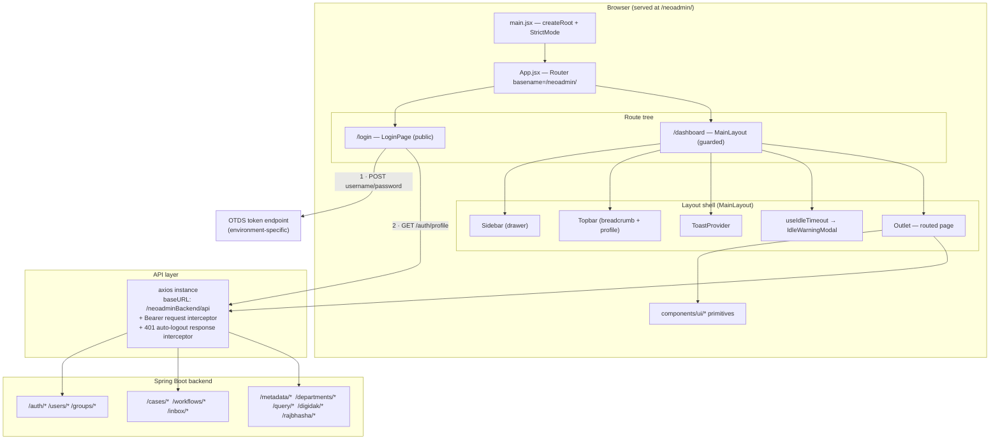
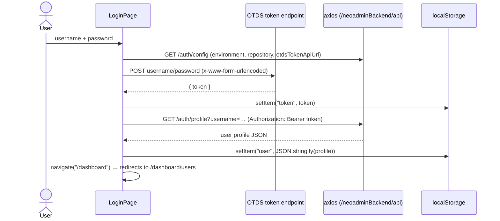

# NEO Admin — Frontend Architecture

> **App name:** "NEO Admin" (NABARD) — the admin / support console for the NABARD ECM
> platform. Manages users, groups, cases, workflows, departments, verticals, metadata and
> DQL queries against a Documentum ECM repository (no relational database).

---

## 1. Overview

| Layer | Technology | Version |
|---|---|---|
| UI framework | React | 19.2 |
| Build tool | Vite | 7.2 (`base: '/neoadmin/'`) |
| CSS | Tailwind CSS | 3.4 |
| Routing | react-router-dom | 7.13 (`<Router basename="/neoadmin/">`) |
| HTTP client | axios | 1.13 |
| Animation | framer-motion | 12.29 |
| Icons | lucide-react | 0.563 |
| Spreadsheet export | exceljs 4.4 (lazy-loaded via `await import('exceljs')`) | — |
| Lint | ESLint 9 (flat config), `eslint-plugin-react-hooks`, `eslint-plugin-react-refresh` | — |

The frontend is served under the path prefix **`/neoadmin/`** and talks to a Spring Boot
backend under **`/neoadminBackend/api`** (see §10). Client state persisted in `localStorage`:
the authenticated user (`user`), the OTDS bearer token (`token`), and DQL query history
(`queryHistory`).

Light mode only — `index.css` forces `color-scheme: light`.

---

## 2. Application architecture



**Dev vs. deployed paths**

| | Dev (`npm run dev`) | Deployed |
|---|---|---|
| App | `http://localhost:5173/neoadmin/` | `https://<host>/neoadmin/` |
| API | `/neoadminBackend/api/*` → Vite proxy strips `/neoadminBackend` → `http://localhost:8080/api/*` | `/neoadminBackend/api/*` served by the app server (Tomcat context `neoadminBackend`) |

---

## 3. Project structure

```
frontend/
  index.html                     # <title>NEO Admin — NABARD</title>, theme-color #14532D
  vite.config.js                 # base: '/neoadmin/'; dev proxy /neoadminBackend/api → :8080
  tailwind.config.js             # "Field ledger" tokens: colours, fonts, type scale, keyframes
  eslint.config.js               # ESLint 9 flat config
  postcss.config.js              # tailwindcss + autoprefixer
  src/
    main.jsx                     # createRoot + <StrictMode>, imports index.css
    App.jsx                      # <Router basename="/neoadmin/">, route table
    index.css                    # Google Fonts @import (Fraunces / IBM Plex Sans / Mono),
                                 #   forced light mode, .ledger-spine, .scrollbar-thin,
                                 #   prefers-reduced-motion reset
    api/
      axios.js                   # shared axios instance + Bearer request interceptor
    hooks/
      useQueryHistory.js         # DQL history in localStorage (max 25, dedup)
      useIdleTimeout.js          # idle warning + auto sign-out
      usePrefersReducedMotion.js # media-query hook, gates all motion
    utils/
      cn.js                      # tiny classnames join helper (no clsx dependency)
      userExport.js              # client-side CSV / XLSX download helpers (lazy exceljs) —
                                 #   used by the User Data Export tab and ReportsPage
    data/
      nabardMetadata.js          # static option lists — grades, office types, RO/TE
                                 #   locations, HO departments
    components/
      layout/
        MainLayout.jsx           # guarded shell: Sidebar + Topbar + Outlet + ToastProvider
        Sidebar.jsx              # drawer nav, Records / Configuration / Tools, role-gated
        Topbar.jsx               # slim h-14 bar: breadcrumb + profile dropdown
      ui/                        # the design-system primitive library (see §7, barrel index.js)
        PageHeader.jsx  DataTable.jsx  Pagination.jsx  Modal.jsx  Button.jsx
        Input.jsx  CustomSelect.jsx  Field.jsx  FormGrid.jsx  Card.jsx  Badge.jsx
        Tabs.jsx  EmptyState.jsx  Skeleton.jsx  Spinner.jsx  ToastProvider.jsx
        README.md
      EditUserProfileModal.jsx   # large user-profile editor (incl. "Retired User" flow)
      ManageMembersModal.jsx     # two-panel group membership editor
      MultiSelectDropdown.jsx    # multi-select used by ReportsPage
      IdleWarningModal.jsx       # countdown dialog from useIdleTimeout
    pages/
      LoginPage.jsx              # OTDS split-screen login
      UsersPage.jsx              # User Management — 6 role-gated tabs (default route)
      CasesPage.jsx              # Case search + workflow detail; embeds Case Inbox / Delegate tabs
      ReportsPage.jsx            # Report / Digidak / Rajbhasha reporting tabs
      WorkflowsPage.jsx          # process-filtered workflow instance browser (master–detail)
      GroupsPage.jsx             # group search + ManageMembersModal
      InboxPage.jsx  CaseInbox2Page.jsx   # task inboxes (near-duplicate, re-styled in tandem)
      DelegatePage.jsx           # case delegation (also surfaced as a Cases tab)
      DepartmentPage.jsx         # NABARD Department Management (Super Admin)
      VerticalsPage.jsx          # HO Vertical Management — add/remove members
      Verticals2Page.jsx         # RO / TE Department Head Assignment
      MetadataPage.jsx           # ECM CONFIG metadata (Case Type, etc.) — tabbed
      SfsPage.jsx                # SFS access management — tabbed (HRMD only)
      QueryPage.jsx              # DQL query console with history + column filters
      UserExportPage.jsx         # "User Data Export" — imported into UsersPage as <UserExportTab>
                                 #   (the /dashboard/user-export route redirects to /users)
```

---

## 4. Routing

Defined in `src/App.jsx`. Router mounts with `basename="/neoadmin/"`, so every path below is
relative to that prefix.

| Path | Component | Notes |
|---|---|---|
| `/` | `Navigate → /login` | |
| `/login` | `LoginPage` | Public. OTDS authentication. |
| `/dashboard` | `MainLayout` | Guarded shell. Redirects (index) to `/dashboard/users`. |
| `/dashboard/users` | `UsersPage` | **Default landing page.** User Management. |
| `/dashboard/cases` | `CasesPage` | Case search + workflow inspection. |
| `/dashboard/reports` | `ReportsPage` | Reporting. |
| `/dashboard/workflows` | `WorkflowsPage` | Workflow instance browser. Hidden from Local Admin. |
| `/dashboard/groups` | `GroupsPage` | Group management. |
| `/dashboard/inbox` | `InboxPage` | Task inbox. |
| `/dashboard/departments` | `DepartmentPage` | NABARD Department Management. Super Admin only. |
| `/dashboard/verticals` | `VerticalsPage` | HO Vertical Management. Super Admin + Local Admin. |
| `/dashboard/verticals2` | `Verticals2Page` | RO / TE Department Head Assignment. |
| `/dashboard/metadata` | `MetadataPage` | ECM CONFIG metadata. |
| `/dashboard/sfs` | `SfsPage` | SFS access management. Shown only for HRMD. |
| `/dashboard/query` | `QueryPage` | DQL console. Hidden from Local Admin. |
| `/dashboard/user-export` | `Navigate → /dashboard/users` | Export moved into a Users tab. |
| `/dashboard/delegate` | `Navigate → /dashboard/cases` | Delegation is a Cases tab. |
| `/dashboard/inbox2` | `Navigate → /dashboard/cases` | Case Inbox is a Cases tab. |
| `*` | `Navigate → /dashboard/users` | Catch-all. |

> `DelegatePage` and `CaseInbox2Page` are still separate files — they render as **tabs inside
> `CasesPage`**, and their standalone routes redirect. `UserExportPage` has no live route of
> its own — `UsersPage` imports it as `UserExportTab` and renders it as the "User Data Export"
> tab; `/dashboard/user-export` redirects to `/dashboard/users`.

### Route guarding & roles

`MainLayout` reads `localStorage.user` and resolves an **admin role** from
`user.properties?.admin_role || user.admin_role`. Recognised values: **`Super Admin`**,
**`Local Admin`**. Anything else (or no user) renders an "Access denied" card that clears the
session and links back to `/login`.

A **Local Admin** is further scoped by `GET /users/profile-context?username=…`, which returns
`office_type` (`HO` / `RO` / `TE`), `location`, and `department_short_code_multi`. The Sidebar
and individual pages use this to hide out-of-scope nav items and constrain queries.

---

## 5. Authentication flow



- The OTDS endpoint and target repository are **environment-derived**: `LoginPage` first asks
  the backend (`GET /auth/config`), and falls back to hostname sniffing
  (`neo.nabard.org` → `EDMS`, `ecmrevampuat.nabard.org` → `NABARDUAT`, Azure IP → `NABARDUAT`,
  else local default `NABARDUAT`). `VITE_DCTM_REPOSITORY` / `VITE_OTDS_URL` override.
- `api/axios.js` request interceptor adds `Authorization: Bearer <token>` from
  `localStorage.token` on every call when a token is present. The backend also maintains
  server-side session state.
- **Session expiry** — `api/axios.js` also has a **response** interceptor: any `401` clears
  `token` + `user` from `localStorage` and hard-redirects to `/neoadmin/login` (guarded by a
  module-level `redirecting` flag against stacked redirects, and skipped when already on the
  login page).
- **Sign-out** (`Topbar` profile menu, `useIdleTimeout`, and the Access-denied card) does
  `localStorage.removeItem('user')` then navigates to `/login`.
- **Idle timeout** — `MainLayout` runs `useIdleTimeout(30_000, 1_800_000)`: after 29½ min of
  no `mousedown / keydown / scroll / touchstart / click`, an `IdleWarningModal` counts down
  30 s, then auto signs out. Any activity during the warning dismisses it.

---

## 6. Layout shell

### 6.1 MainLayout — `src/components/layout/MainLayout.jsx`

- Wraps the guarded routes; mounts `<ToastProvider>` once (all `useToast()` calls resolve
  here) and the idle-timeout hook + `IdleWarningModal`.
- Owns the mobile sidebar open/close state (drawer + backdrop).
- Structure:
  ```
  <Sidebar open=… onClose=… />
  <Topbar onMenuClick=… />
  <main className="min-h-[100dvh] overflow-x-hidden pt-14 lg:pl-64">
    <div className="flex min-h-[calc(100dvh-3.5rem)] w-full flex-col p-4">
      <Outlet />
    </div>
  </main>
  ```
- **Full-bleed**: no centred `max-w` cap, uniform 16px (`p-4`) padding at every breakpoint —
  deliberately matches the production Case Management System, where tables and filter grids
  use the whole viewport.

### 6.2 Sidebar — `src/components/layout/Sidebar.jsx`

- Off-canvas **drawer**: `fixed left-0 top-0 z-40 w-64`, `-translate-x-full` when closed,
  `translate-x-0` when open, always visible from `lg` (`lg:translate-x-0`, paired with
  `lg:pl-64` on `<main>`).
- Wordmark: **"NEO Admin" / "NABARD"** with a `Compass` glyph in a `bg-canopy` tile.
- Nav grouped into **`Records`**, **`Configuration`**, **`Tools`** sections with IBM Plex
  Mono small-caps labels and `line` dividers.

| Section | Item | Path | Icon | Visibility |
|---|---|---|---|---|
| Records | User Management | `/dashboard/users` | `Users` | all |
| Records | Cases | `/dashboard/cases` | `Briefcase` | all |
| Records | Reports | `/dashboard/reports` | `FileBarChart2` | all |
| Records | Workflows | `/dashboard/workflows` | `GitBranch` | hidden for Local Admin |
| Configuration | NABARD Department Management | `/dashboard/departments` | `Building2` | Super Admin |
| Configuration | HO Vertical Management | `/dashboard/verticals` | `Network` | Super Admin, Local Admin (hidden if RO/TE) |
| Configuration | RO/TE Department Head Assignment | `/dashboard/verticals2` | `Network` | Super Admin, Local Admin (hidden if HO) |
| Configuration | Metadata | `/dashboard/metadata` | `FolderCog` | all |
| Configuration | SFS | `/dashboard/sfs` | `FolderCog` | only when the user's dept is HRMD |
| Tools | Query | `/dashboard/query` | `Database` | hidden for Local Admin |

- **Active item** = `bg-canopy-tint text-canopy` plus a 3px `canopy` **ledger spine**
  (`before:` pseudo-element) on the left edge.
- All role / office-type / department filtering is computed from `localStorage.user` +
  `GET /users/profile-context`.

### 6.3 Topbar — `src/components/layout/Topbar.jsx`

- Slim `h-14`, `fixed`, `lg:left-64`.
- Left: mobile menu button (`onMenuClick`) + an **IBM Plex Mono breadcrumb** from a `CRUMBS`
  map (`users → "User Management"`, `cases → "Cases"`, `reports → "Reports"`, `workflows →
  "Workflows"`, `departments → "NABARD Departments"`, `verticals → "HO Verticals"`,
  `verticals2 → "RO / TE Dept Heads"`, `metadata → "Metadata"`, `sfs → "SFS"`,
  `query → "Query"`, …).
- Right: profile dropdown — initials avatar, name, email, "Privileges" (= admin role),
  **Sign out**. `animate-fade-rise` on open; outside-click closes via a `mousedown` listener.
- The old "Login Ticket Generator" block and `fetchCurrentUser` were **removed** in the
  redesign.

---

## 7. Design system — "Field ledger"

The single source of truth is `frontend/src/components/ui/README.md` + `tailwind.config.js`.
Summary:

### 7.1 Colour tokens (`theme.extend.colors`)

| Token | Hex | Role |
|---|---|---|
| `canopy` / `canopy-dark` / `canopy-tint` | `#14532D` / `#0E3D21` / `#EAEFE9` | primary — buttons, active nav, links, focus ring, table row band |
| `harvest` | `#B45309` | single warm accent — secondary CTA, warnings |
| `ink` | `#1A2E1F` | body text (warm near-black) |
| `paper` | `#F6F7F4` | app background |
| `line` | `#E2E5DE` | hairlines, borders, dividers |
| `danger` / `danger-tint` | `#B42318` / `#FEF3F2` | destructive actions, errors |
| `info` / `info-tint` | `#1E5F8C` / `#EFF6FB` | informational only, sparingly |
| `success` / tint | `#14532D` / `#EAEFE9` | success |

Cards are pure `#FFFFFF`. Neutral greys use Tailwind `slate-*` (muted text = `slate-500`).
Status is a token + a text label — never a rainbow of hues. **No hard-coded hex in components.**

### 7.2 Typography (Google Fonts `@import` in `index.css`)

| Role | Family | Usage |
|---|---|---|
| `font-display` | **Fraunces** (400–600) | page mastheads, login, empty-state headlines **only** — never body |
| `font-sans` | **IBM Plex Sans** (stack also names *IBM Plex Sans Devanagari* as a fallback family for Hindi, though only IBM Plex Sans itself is `@import`-ed) | all interface text |
| `font-mono` | **IBM Plex Mono** | identifiers — UIN, `r_object_id`, codes, timestamps, counts, DQL. Carries `tabular-nums` via a `.font-mono` rule in `index.css`. |

Fixed type scale: `text-display-lg` (1.875rem), `text-display` (1.5rem), `text-title`
(1.125rem), `text-body` (0.875rem), `text-caption` (0.75rem).

### 7.3 Other tokens

- `borderRadius.card` = 12px; `boxShadow` `card` (subtle) and `pop` (overlays).
- Extra breakpoint `screens.xs` = 480px (Tailwind `sm` = 640px, `md` = 768px, `lg` = 1024px).
- Keyframes / animations: `sheet-up` 0.2s (mobile bottom sheet), `pop-in` 0.2s (modal /
  dropdown), `spine-grow` 0.12s (nav spine), `toast-in` 0.15s, `fade-rise` 0.18s.
- `plugins: []` — no Tailwind plugins, no `clsx` / `tailwind-merge` (see `utils/cn.js`).

### 7.4 The "ledger spine"

A 3px `canopy` vertical rule on the left edge of: the active sidebar nav item, every page
masthead (`PageHeader`), record/folio cards on mobile, and a `DataTable` row on hover.
Utility: `.ledger-spine` in `index.css`; `Card` exposes a `spine` prop.

### 7.5 Motion

All motion is gated behind `usePrefersReducedMotion()` / `motion-safe:`. `index.css` also
carries a global `@media (prefers-reduced-motion: reduce)` reset. Route-level transitions use
framer-motion; component-level use the CSS keyframe tokens above.

---

## 8. Component library — `src/components/ui/`

Import from the barrel: `import { PageHeader, DataTable, Button, Modal, useToast } from '../components/ui'`.

| Component | Purpose | Key props |
|---|---|---|
| `PageHeader` | Page masthead — ledger spine + Fraunces title + description + `actions` slot. One per page. | `title`, `description`, `actions`, `icon` |
| `DataTable` | The one table treatment: sticky header, sortable columns, built-in skeleton + empty state, row-hover spine. **Reflows every row to a "folio card" below `md`.** | `columns`, `rows`, `rowKey`, `loading`, `sort`, `onSortChange`, `empty`, `onRowClick` |
| `Pagination` | "Showing a–b of c" + rows-per-page + chevrons. Works with `total` **or** `hasNext`. Stacks on phones. | `page`, `pageSize`, `total` / `hasNext`, `onPageChange`, `onPageSizeChange` |
| `Modal` | Centred dialog (`sm:max-h-[85dvh]`) on tablet/desktop, **full bottom sheet on phones** (`max-h-[92dvh]`, `rounded-t-2xl`). Portal to `document.body`, `z-[9990]`. Sticky header + optional footer, `scrollbar-thin` body, Esc / backdrop close, focus on open. | `isOpen`, `onClose`, `title`, `footer`, `size` (`sm`…`4xl`), `closeOnBackdrop` |
| `Button` | `variant`: `primary` \| `secondary` \| `ghost` \| `danger` \| `accent`. `size`: `sm` \| `md` \| `icon`. | `loading`, native button props |
| `Input` / `Textarea` | One focus-ring recipe (`ring-canopy/20` + `border-canopy`). | `invalid` |
| `CustomSelect` | The one dropdown treatment. **Portal panel** that escapes `overflow:hidden` / transformed modals, auto-flips up, repositions on scroll, viewport-edge clamp, keyboard nav + ARIA (`role="combobox"`/`listbox`), auto filter input when options > ~12. Value-based `onChange(value)`. | `value`, `onChange`, `options` `[{value,label,disabled?}]`, `placeholder`, `invalid`, `searchable` (`'auto'`), `disabled`, `id`, `name` |
| `Field` / `Label` | Label + control slot + help/error line. | `label`, `required`, `error`, `help` |
| `FormGrid` | `grid-cols-1` → `cols` at `md`. `FormGrid.Full` spans a child. | `cols` (2 \| 3 \| 4) |
| `Card` | White surface, `rounded-card border-line shadow-card`. | `spine`, `pad` |
| `Badge` | Status pill. | `tone`: `neutral` \| `canopy` \| `harvest` \| `danger` \| `info` |
| `Tabs` | Horizontally-scrollable tab bar (mobile). Callers filter tabs by role **before** passing. | `tabs`, `value`, `onChange` |
| `EmptyState` | No-data state with optional `action`. | `icon`, `title`, `description`, `action` |
| `Skeleton` / `Spinner` | Loading placeholders. | — |
| `ToastProvider` / `useToast` | App-wide toasts, mounted once in `MainLayout`. `aria-live`. | `toast.success/error/info(msg)`, `toast.show({ type, message })` |

### `DataTable` column shape

```js
{
  key,                                   // unique; default sort id
  header,                                // '' allowed (actions column)
  render?(row, i) => node,               // defaults to row[key]
  align?: 'left' | 'center' | 'right',
  mono?: boolean,                        // tabular mono figures
  sortable?: boolean,
  sortKey?: string,                      // when the sort id ≠ key
  width?: string,                        // tailwind width class for the <th>
  card?: 'body' | 'footer' | 'hide',     // placement in the mobile folio card
  primary?: boolean,                     // headline field on the mobile card
  cardLabel?: string,                    // label override on the mobile card
}
```

`sort` is `{ key, dir: 'asc' | 'desc' } | null`; `onSortChange` receives the next value
(cycles asc → desc → null). **The page still owns the actual sort/filter/paginate of `rows`**
— `DataTable` is presentational.

---

## 9. Page catalog

Every routed page uses the standard shell:

```jsx
return (
  <div className="flex flex-1 flex-col">
    <PageHeader title="…" description="…" actions={…} />
    {/* body — full content width */}
  </div>
);
```

Exceptions: `Modal`, `LoginPage`, and `WorkflowsPage` (master–detail split).

### 9.1 UsersPage — `/dashboard/users` *(default route)*

User Management. `Tabs` shell with **6 role-gated tabs**; the tab list is filtered by
`adminRole` before being handed to `Tabs`:

| Tab | Roles | Summary |
|---|---|---|
| User Creation | Super Admin | 3-step wizard → `POST /users` → `POST /users/otds/setup` → `POST /users/profile` |
| User Directory | Super Admin, Local Admin (scoped) | **Server-side paginated** list (`GET /users/profiles` with `page`/`size`/`query`/`uin`/`grade`/`deptCode`/`roCode`/`sortBy`/`sortDir`); page sizes 15 / 25 / 50 (default 25). Edit → `EditUserProfileModal` → `PATCH /users/profiles/{r_object_id}`. "User State" + "Retired User" controls are Super-Admin-only. |
| User Access | Super Admin, Local Admin (scoped) | Grants `ecm_local_admin` + CGM-section groups (`ecm_ho_<dept>_cgm_sec`, `ecm_<ro>_cgm_sec`, Digidak variants). |
| User Data Export | Super Admin | CSV / XLSX roster via `utils/userExport.js`; all-offices multi-sheet roster; excludes "NEO" names. |
| Alternate CGM | Super Admin | Grade-F HO users only; `ecm_<dept>_alternate_cgm`. "Manage" opens a `Modal` with a `CustomSelect` department picker. |
| User Password Update | Super Admin | Single + bulk; `PATCH /users/{login}/password`. |

Large file (~3.4k lines). All data fetching, filtering, role-gating, and the User Directory /
Alternate CGM / User-Export logic are behaviour — the redesign was presentational only.

### 9.2 CasesPage — `/dashboard/cases`

Case search by case number (server-side paginated, default load shows recent cases) + a
**Workflow Detail** modal (multiple-workflow sidebar, activity table with restart / retry,
log sub-modal). Also hosts the **Case Inbox** (`CaseInbox2Page`) and **Delegate Case**
(`DelegatePage`) content as tabs. Endpoints: `GET /cases/search`, `GET /settings`,
`GET /workflows/case/{objectId}`, `POST /workflows/{id}/restart`,
`POST /workflows/{id}/activity/{actId}/retry`.

### 9.3 ReportsPage — `/dashboard/reports`

Reporting console with **Report / Digidak / Rajbhasha** tabs (the Rajbhasha tab is hidden
from Local Admin). Office / location / department filters (some via `MultiSelectDropdown`),
tabular results, page-size picker. Endpoints: `GET /cases/report` + `GET /cases/count` (Report
tab), `GET /digidak/{report,inbox,draft,count,metadata,verticals,…}` (Digidak tab),
`GET /rajbhasha/report` + `GET /rajbhasha/report/export` (Rajbhasha tab). XLSX export is built
client-side via `utils/userExport.js` helpers (lazy `exceljs`).

### 9.4 WorkflowsPage — `/dashboard/workflows` *(hidden from Local Admin)*

Master–detail: process-definition list on the left, workflow instances on the right; on
mobile the detail becomes a back-navigable pane. `GET /workflows/processes`,
`GET /workflows/instances?processName=&page=&size=`. Parses the Documentum REST shape
(`response.data.entries[].content.properties`), `links[] rel:'next'` pagination.

### 9.5 GroupsPage — `/dashboard/groups`

Group search (`GET /groups/search`), `DataTable`, member-count column, "Manage" →
`ManageMembersModal`.

### 9.6 InboxPage / CaseInbox2Page — `/dashboard/inbox`

Task inboxes over `GET /inbox/tasklist`. Near-duplicate implementations, re-styled in tandem
(a merge is a separate behavioural change, out of scope).

### 9.7 DepartmentPage — `/dashboard/departments` *(Super Admin)*

NABARD Department Management. Single `Card` form — Office Type, Location, Department Name,
Short Code, DMD radios — laid out as a responsive grid; create + result panel below.

### 9.8 VerticalsPage / Verticals2Page — `/dashboard/verticals`, `/dashboard/verticals2`

**HO Vertical Management** and **RO / TE Department Head Assignment**. Add Members / Remove
Members / creation flows with hand-rolled multi-user pickers and an info-panel row. Local
Admins see only the one relevant to their office type.

### 9.9 MetadataPage — `/dashboard/metadata`

ECM CONFIG metadata (Case Type, …). `PageHeader` + `Tabs`; each tab = a create form + list
over `GET/POST /api/metadata/<name>s`. Follow the Case Type pattern when adding types.

### 9.10 SfsPage — `/dashboard/sfs` *(shown only when the user's department is HRMD)*

SFS document-type + access management; tabbed; office / location / department / role
`CustomSelect`s in create + edit modals.

### 9.11 QueryPage — `/dashboard/query` *(hidden from Local Admin)*

DQL console. Monospace textarea, selective execution (highlight + Ctrl/Cmd+Enter),
`useQueryHistory` dropdown (max 25, dedup, copy / load), configurable `RETURN_TOP`
(100–10 000), per-column client-side filters, client-side pagination.
`POST /query/execute { dql, limit }`.

### 9.12 LoginPage — `/login`

Split screen: left `bg-canopy` brand panel with a Fraunces masthead, right white card on
`bg-paper`. Username / password (show-password toggle), inline error. OTDS flow (§5). Not
inside the shell.

---

## 10. API integration

### `src/api/axios.js`

```js
import axios from 'axios';

const api = axios.create({
  baseURL: '/neoadminBackend/api',
  headers: { 'Content-Type': 'application/json' },
});

// request: attach the OTDS bearer token
api.interceptors.request.use((config) => {
  const token = localStorage.getItem('token');
  if (token) config.headers.Authorization = `Bearer ${token}`;
  return config;
});

// response: auto sign-out on an expired / invalid session
const LOGIN_PATH = '/neoadmin/login';
let redirecting = false;
api.interceptors.response.use(
  (response) => response,
  (error) => {
    if (error.response?.status === 401 && !redirecting) {
      const onLoginPage = window.location.pathname.startsWith(LOGIN_PATH);
      localStorage.removeItem('token');
      localStorage.removeItem('user');
      if (!onLoginPage) { redirecting = true; window.location.assign(LOGIN_PATH); }
    }
    return Promise.reject(error);
  }
);

export default api;
```

- **Dev**: `vite.config.js` proxies `/neoadminBackend/api/*` → `http://localhost:8080`,
  stripping the `/neoadminBackend` prefix (backend serves the same APIs at `/api`).
- **Deployed**: the app server serves the backend under the `neoadminBackend` context, so the
  same relative path works with no proxy.
- **Request** interceptor: Bearer token. **Response** interceptor: 401 → clear stored
  credentials + redirect to the login screen (see §5).

### Representative endpoints by area

| Area | Endpoints (non-exhaustive) |
|---|---|
| Auth | `GET /auth/config`, `GET /auth/profile?username=`, `POST /auth/login` |
| Users | `GET /users/profiles` (paged + filtered), `GET /users/profile-context?username=`, `POST /users`, `POST /users/otds/setup`, `POST /users/profile`, `PATCH /users/profiles/{id}`, `PATCH /users/{login}/password` |
| Groups | `GET /groups/search`, `GET /groups/{name}/members`, `GET /groups/search-members`, `GET /groups/by-user?username=`, `POST /groups/{name}/members`, `DELETE /groups/{name}/members/{member}` |
| Cases / Workflows | `GET /cases/search`, `GET /workflows/case/{objectId}`, `GET /workflows/processes`, `GET /workflows/instances`, `POST /workflows/{id}/restart`, `POST /workflows/{id}/activity/{actId}/retry` |
| Inbox | `GET /inbox/tasklist` |
| Reports | `GET /cases/report`, `GET /cases/count`, `GET /digidak/*` (`/report`, `/inbox`, `/draft`, `/count`, `/metadata`, `/movement`, …), `GET /rajbhasha/report`, `GET /rajbhasha/report/export` |
| Metadata / Departments | `GET|POST /metadata/<name>s`, department CRUD under `/departments/*` |
| Query | `POST /query/execute` |
| Settings | `GET /settings` |

---

## 11. State management

React-local only — no Redux / Zustand / global store. One app-wide **Context**: `ToastProvider`.

| Primitive | Usage |
|---|---|
| `useState` | all component state (forms, lists, loading, modals, pagination) |
| `useEffect` | data fetching, dependent fetches, outside-click listeners |
| `useCallback` | memoised fetch functions |
| `useMemo` | derived data (QueryPage column filters, option lists) |
| `useRef` | dropdown / textarea refs, stale-response guards (`fetchIdRef`) |
| `useContext` | `useToast()` |
| `localStorage` | `user`, `token`, `queryHistory` |

### Custom hooks

- **`useQueryHistory`** — up to 25 DQL entries in `localStorage.queryHistory`; `addQuery`
  (dedup — moves an existing entry to the top), `removeQuery(id)`, `clearHistory()`.
- **`useIdleTimeout(warningMs, logoutMs)`** — returns `{ showWarning, remainingTime,
  handleContinue }`; wired to `IdleWarningModal` in `MainLayout` at `(30_000, 1_800_000)`.
- **`usePrefersReducedMotion`** — boolean from the `(prefers-reduced-motion: reduce)` media
  query; gates all component motion.

---

## 12. Conventions

### Naming

| Item | Convention | Example |
|---|---|---|
| Page components | PascalCase + `Page` | `UsersPage`, `LoginPage` |
| Modal components | PascalCase + `Modal` | `EditUserProfileModal` |
| Layout / UI primitives | PascalCase | `MainLayout`, `DataTable` |
| Hooks | `use` + camelCase | `useIdleTimeout` |
| Utils / API module | camelCase / lowercase | `cn.js`, `axios.js` |

### Component structure

Imports → component fn → state → effects/fetchers → handlers → helpers/sub-components → JSX
→ default export.

### Styling rules

- Semantic tokens only — no `#hex`, no `blue-*` / `indigo-*` accent. Merge classes with
  `cn()`.
- Build from `components/ui/` primitives; do not re-implement Button / Input / Modal / table
  inline.
- Fraunces for mastheads only; IBM Plex Mono for every identifier, count, date and DQL string.
- Every view must work at **375px**: `DataTable` → folio cards, forms → single column,
  modals → bottom sheets, filter bars → `flex-wrap`.

### Linting

`npm run lint` = `eslint .` (flat config). `react-hooks` and `react-refresh` plugins active.
Unused vars error **except** names matching `^[A-Z_]` (`varsIgnorePattern`) — e.g. a
capitalised helper or a `motion` import used only via `<motion.div>`. Fully replace unused
callback params (a leftover `e =>` is a `no-unused-vars` error).

### Icons

All from `lucide-react`. Nav: `Users` `Briefcase` `FileBarChart2` `GitBranch` `Building2`
`Network` `FolderCog` `Database` `Compass`. Common: `Search`, `Loader2` (`animate-spin`),
`X`, `ChevronLeft/Right`, `ChevronsLeft`, `Eye`, `Edit2`, `Check`, `Copy`, `LogOut`,
`AlertCircle`.

---

## 13. Not covered / out of scope

- The near-duplicate page pairs (`InboxPage` / `CaseInbox2Page`,
  `VerticalsPage` / `Verticals2Page`) are styled in tandem but **not merged** — a merge is a
  behavioural change tracked separately.
- `DataTable` has no column-width model yet; very wide free-text columns can stretch at
  ≥ 1920px (matches the production app; a sizing pass is deferred).
- No automated frontend tests. Verification is `npm run lint` + `npm run build` + a manual
  responsive walk at 375 / 768 / 1280 / 1920px.
